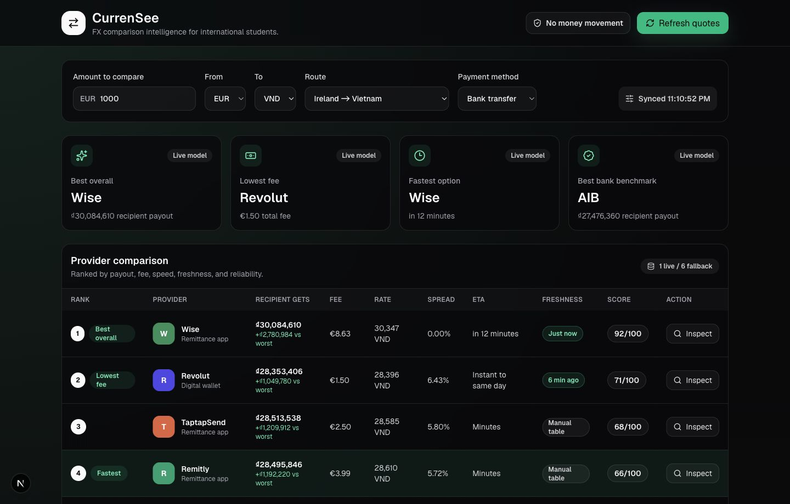
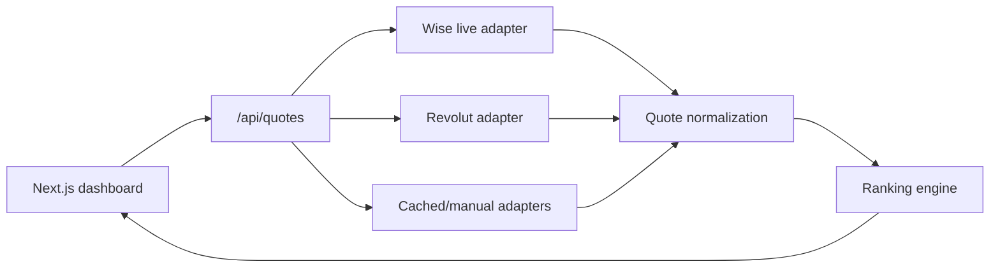

# CurrenSee

CurrenSee is an FX comparison dashboard for international students and expats who want to see the real cost of sending money abroad before choosing a provider.

[Live demo](https://currensee-app.vercel.app)



## Why This Exists

International transfers are hard to compare because providers split cost across exchange-rate spread, visible transfer fees, payment method fees, delivery speed, and quote freshness. CurrenSee normalizes those pieces into one ranked dashboard.

The app does not move money, hold balances, or initiate transfers. It is a comparison and decision-support tool.

## Features

- Multi-currency comparison across `EUR`, `GBP`, `USD`, `VND`, `INR`, `PHP`, `THB`, `CAD`, `AUD`, and `JPY`
- Live Wise quote adapter using the unauthenticated Wise Platform quote endpoint
- Optional Revolut Business API adapter via environment token
- Cached or manual fallback adapters for Remitly, TaptapSend, AIB, Bank of Ireland, and Permanent TSB
- Provider ranking by recipient payout, fee, speed, freshness, and reliability
- Fee breakdown with effective rate, hidden FX cost, and spread against benchmark rate
- Data quality labels: `Live API`, `Cached adapter`, `Partner access required`, and `Manual bank table`
- Watchlist UI prepared for future Firebase alerts
- Responsive dashboard UI built for desktop and mobile

## Architecture



## Provider Strategy

CurrenSee uses a hybrid adapter design because not every fintech provider exposes public quote APIs.

| Provider | Current integration | Notes |
| --- | --- | --- |
| Wise | Live API | Uses Wise unauthenticated quote flow. |
| Revolut | Optional live API | Requires `REVOLUT_BUSINESS_API_TOKEN`. |
| Remitly | Partner-access fallback | Public quote API access is not configured. |
| TaptapSend | Partner-access fallback | Public quote API access is not configured. |
| Irish banks | Manual table fallback | Useful for traditional-bank benchmarks. |

## Tech Stack

- Next.js App Router
- TypeScript
- Tailwind CSS
- Lucide React icons
- Vercel-ready API routes

## Local Development

```bash
npm install
npm run dev
```

Open [http://localhost:3000](http://localhost:3000).

## Environment Variables

Wise live quotes work without local credentials in the current flow.

Create `.env.local` if you want to enable optional Revolut quotes:

```bash
REVOLUT_BUSINESS_API_TOKEN=
REVOLUT_API_BASE_URL=https://b2b.revolut.com/api/1.0
```

## Scripts

```bash
npm run dev
npm run lint
npm run build
```

## Future Work

- Store quote snapshots in Firestore
- Add saved routes and watchlists with Firebase Auth
- Trigger scheduled quote refresh with Vercel Cron or Firebase Cloud Functions
- Replace fallback adapters as partner/API access becomes available
- Add email alerts for target exchange rates

## Data Disclaimer

Wise rows may use live API data. Revolut, Remitly, TaptapSend, and Irish bank rows may use cached or manually maintained fallback data unless their live credentials or partner access are configured. Always verify final pricing on the provider website before sending money.
